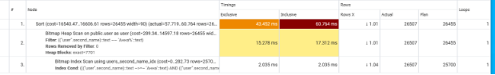

## **Домашнее задание**
Производительность индексов 

1) Для генерации тестовых данных использовался готовый список из «реальных» Имен и Фамилий.
1) Реализован функционал поиска анкет по префиксу имени и фамилии (реализован метод [/user/search из спецификации](https://github.com/OtusTeam/highload/blob/master/homework/openapi.json#L165)) (запрос в форме firstName LIKE ? and secondName LIKE ?). Сортировать вывод по id анкеты. При отсутствии одного из параметров, данный параметр исключается из поиска, например если отсутствует  firstName, то поиск делается только по  secondName
1) Проведены нагрузочные тесты этого метода с количеством одновременных запросов 1/10/100/1000 до добавления индекса и после.
   Длительность теста 120 секунд

   ` `
   До добавления индекса. Количеством одновременных запросов 1

   
   ` `После добавления индекса. Количеством одновременных запросов 1 
   До добавления индекса. Количеством одновременных запросов 10

   
   ` `После добавления индекса. Количеством одновременных запросов 10 
   До добавления индекса. Количеством одновременных запросов 100

   
   ` `После добавления индекса. Количеством одновременных запросов 100 
   До добавления индекса. Количеством одновременных запросов 1000

   
   ` `После добавления индекса. Количеством одновременных запросов 1000
1) Сделаны подходящие индексы. 

   CREATE INDEX users\_first\_name\_idx ON public.user(first\_name text\_pattern\_ops);

   CREATE INDEX users\_second\_name\_idx ON public.user(second\_name text\_pattern\_ops);

   Используется ключевое слово text\_pattern\_ops т. к. поиск делается с использованием оператора LIKE.

   Добавлено 2 индекса, т. к. используется 3 сценария поиска 

   1) по first\_name и second\_name — охватывается первым и вторым индексом
   1) по first\_name — охватывается первым индексом
   1) по second\_name — требуется второй индекс

` `Планы запроса после добавления индекса(Соответствуют сценариям):

1) Выводы
   1) Добавление индекса позволило уменьшить latency и увеличить throughput, но чем больше число пользователей, тем меньше разница между использованием индекса и отсутствием. Предположительно упираемся в другие ограничения.
   1) Для получения более показательных результатов добавления индекса, будет правильно ограничить ресурсы контейнера с PostgreSQL(ЦП, ОЗУ, disk I/O).

